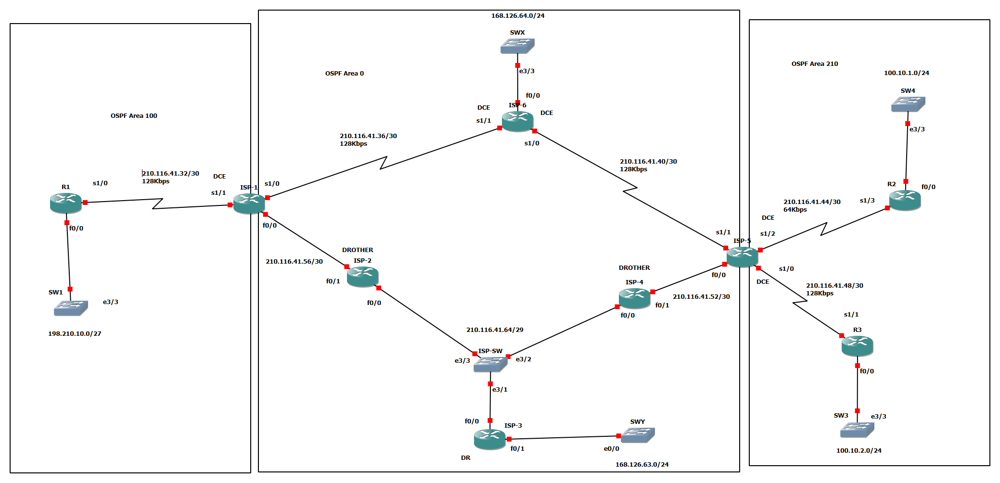

# OSPF Multi-Area & ACL Lab (Cisco IOS / GNS3)


**OSPF Multi-Area, Virtual-Link, DR/BDR, ACL 종합 실습 (Cisco IOS / GNS3)**

---

## 📌 프로젝트 개요

GNS3 / Cisco IOS 환경에서 **6개의 ISP 백본 라우터**와 **3개의 고객사 라우터(R1, R2, R3)**를 OSPF로 구성하고, ISP-1에서 Extended ACL로 트래픽을 제어하는 종합 실습 프로젝트입니다.

| 항목 | 내용 |
| --- | --- |
| 라우팅 프로토콜 | OSPF (Process 100) |
| 라우터 수 | 9대 (ISP 6대 + 고객사 R1/R2/R3) |
| Area 구성 | Area 0 (백본), Area 100, Area 210 |
| 핵심 기술 | Multi-Area OSPF, DR/BDR 선출, Passive Interface, Loopback Point-to-Point, Extended ACL |
| 시뮬레이터 | GNS3 (Cisco IOS c3745) |

---

## 🗺️ 네트워크 토폴로지



### Area 구성

- **OSPF Area 100**: ISP-1 + R1 + 내부 LAN (198.210.10.0/27)
- **OSPF Area 0 (Backbone)**: ISP-1 ~ ISP-6 + SWY LAN (168.126.63.0/24)
- **OSPF Area 210**: ISP-5 + R2 + R3 + 내부 LAN (100.10.1.0/24, 100.10.2.0/24)

### 회선 / 인터페이스 구성

- **WAN 구간 (HDLC)**:
  - `211.116.41.32/30` (R1 ↔ ISP-1) - 128Kbps
  - `210.116.41.40/30` (ISP-6 ↔ ISP-5) - 128Kbps
  - `210.116.41.44/30` (ISP-5 ↔ R2) - **64Kbps**
  - `210.116.41.46/30` (ISP-1 ↔ ISP-6) - 128Kbps
  - `210.116.41.48/30` (ISP-5 ↔ R3) - 128Kbps
  - `210.116.41.52/30` (ISP-4 ↔ ISP-5) - 128Kbps
  - `210.116.41.56/30` (ISP-1 ↔ ISP-2) - 128Kbps
- **Multi-Access 구간 (FastEthernet)**: `210.116.41.64/29`
  - ISP-2 (e3/3), ISP-3 (e3/1), ISP-4 (e3/2)가 **ISP-SW**로 연결
  - → **ISP-3 = DR**, BDR 미선출 (ISP-2/ISP-4 Priority = 0)
- **LAN 구간 (FastEthernet)**:
  - `198.210.10.0/27` (R1 ↔ SW1) - Area 100
  - `100.10.1.0/24` (R2 ↔ SW4) - Area 210
  - `100.10.2.0/24` (R3 ↔ SW3) - Area 210
  - `168.126.63.0/24` (ISP-3 ↔ SWY) - Area 0
  - SWX (ISP-6 e3/3 연결)


### 핵심 포인트

- **R1**의 외부 LAN (198.210.10.0/27)이 ISP-1을 통해 백본으로 진입
- **ISP-1**은 Area 100과 Area 0를 잇는 **ABR**
- **ISP-5**는 Area 0와 Area 210을 잇는 **ABR**
- **ISP-3**은 Multi-Access 구간의 **DR** 역할 (SWY LAN 포함)
- R2 ↔ ISP-5 구간은 **64Kbps**로 가장 저속 → OSPF Cost 영향

---
## 📁 프로젝트 구조

```
OSPF-ACL-Multi-ISP-Network/
├── docs/                              # OSPF / ACL 이론 문서
│   ├── 01-ospf-theory.md
│   ├── 02-ospf-pdu.md
│   ├── 03-ospf-neighbor-state.md
│   ├── 04-dr-bdr.md
│   ├── 05-lsa-type.md
│   ├── 06-virtual-link.md
│   ├── 07-ospf-authentication.md
│   └── 08-acl-theory.md
├── preconfig/                         # 단계별 실습 사전 설정
│   └── 01-ospf-loopback-preconfig.txt
├── verification/                      # 검증 명령어 모음
│   └── verification-commands.md
├── topology/
│   └── OSPF-ACL-Multi-ISP-Network.png
├── LICENSE
└── README.md
```

### 학습 순서

1. 📘 **이론 학습** → [`docs/`](./docs/) 폴더의 문서를 순서대로 읽기
2. 🛠️ **실습 진행** → [`preconfig/`](./preconfig/) 폴더의 설정 파일 따라 입력
3. 🔍 **결과 검증** → [`verification/verification-commands.md`](./verification/verification-commands.md) 명령어로 확인

---
## 📚 OSPF 핵심 이론 요약 (docs/)

자세한 내용은 `docs/` 폴더를 참고하세요.

| 문서 | 내용 |
| --- | --- |
| [01. OSPF 이론](./docs/01-ospf-theory.md) | Link-State 알고리즘, AD=110, Cost 계산법 |
| [02. OSPF 5가지 PDU](./docs/02-ospf-pdu.md) | Hello, DBD, LSR, LSU, LSAck |
| [03. Neighbor State](./docs/03-ospf-neighbor-state.md) | Down→Init→2-Way→ExStart→Exchange→Loading→Full |
| [04. DR/BDR](./docs/04-dr-bdr.md) | Priority 기반 선출, Multi-Access 환경 |
| [05. LSA Type](./docs/05-lsa-type.md) | Type 1~5 (Router/Network/Summary/ASBR-Summary/External) |
| [06. Virtual-Link](./docs/06-virtual-link.md) | Backbone 단절 시 우회 연결 |
| [07. OSPF 인증](./docs/07-ospf-authentication.md) | Plain Text / MD5, Neighbor / Area 인증 |
| [08. ACL 이론](./docs/08-acl-theory.md) | Standard(1-99) / Extended(100-199) |

---

## 💡 학습 포인트

- **Multi-Area OSPF**: Area 0(백본)과 비-백본 Area의 ABR 역할 이해
- **DR/BDR 선출 제어**: Priority `0`(선출 제외) / `255`(우선 DR) 활용
- **Passive-interface default**: 보안과 효율을 위한 OSPF 송신 제어
- **Loopback Point-to-Point**: 기본 /32가 아닌 인터페이스 마스크 그대로 광고
- **Extended ACL**: 출발지/목적지 IP + Port + Protocol 조합 필터링
- **OSPF Protocol 89 허용**: ACL 적용 시 OSPF Neighbor가 끊기지 않도록 `permit ospf` 추가

---

## 🎯 실습 목표

| # | 실습 내용 | Preconfig 파일 |
| :---: | --- | --- |
| **EX1** | 라우터 기본 설정 (Loopback / IP / Telnet / Enable 패스워드) | [`01-ospf-loopback-preconfig.txt`](./preconfig/01-ospf-loopback-preconfig.txt) |
| **EX2** | LAN(Ethernet) / WAN(HDLC) IP 할당 및 Next-hop 통신 확인 | [`02-ospf-router-ip-preconfig.txt`](./preconfig/02-ospf-router-ip-preconfig.txt) |
| **EX3** | OSPF Multi-Area 구성 + ISP-3 DR 선출 + Loopback Area 분리 | [`03-oppf-router-preconfig.txt`] (./preconfig/03-oppf-router-preconfig.txt) |
| **EX4** | ISP-1에서 Extended ACL로 R1 → R2/R3 트래픽 제어 | *(추가 예정)* |
| **EX5** | Routing Table / Database Table / LSA-Type 검증 | [`verification-commands.md`](./verification/verification-commands.md) |

---

### 🔑 OSPF 핵심 요약

#### OSPF 특성

- **표준 공개 프로토콜** (모든 제조사 라우터 지원, RFC 2328)
- **Link-State 알고리즘** (Dijkstra SPF 기반 Loop-free 최단 경로)
- **Classless**: SubnetMask 포함, VLSM/CIDR 지원
- **Protocol 번호 89번** 사용
- **Multicast 주소**: `224.0.0.5` (All OSPF Router), `224.0.0.6` (DR/BDR)

#### AD (Administrative Distance)

| Protocol | AD 값 | 비고 |
|----------|-------|------|
| Connected | 0 | |
| Static | 1 | |
| EIGRP Internal | 90 | Bandwidth + Delay |
| **OSPF** | **110** | **Bandwidth 기반 Cost** |
| RIP | 120 | Hop-count |
| EIGRP External | 170 | 재분배 경로 |

#### OSPF Metric (Cost) 공식

```
Cost = Reference-Bandwidth / Interface-Bandwidth
     = 10^8 (기본 100Mbps) / 인터페이스 대역폭(bps)
```

> **기준 대역폭 변경 권장**: `auto-cost reference-bandwidth 1000`  
> → GigabitEthernet과 FastEthernet의 Cost 구분 가능

| 인터페이스 | 기본 Cost | 변경 후 Cost (1Gbps 기준) |
|------------|:--------:|:------------------------:|
| GigabitEthernet | 1 | 1 |
| FastEthernet | 1 | 10 |
| Ethernet | 10 | 100 |
| Serial (T1, 1.544Mbps) | 64 | 647 |

#### OSPF 5가지 PDU

| PDU | 역할 |
|-----|------|
| **Hello** | Neighbor 발견 및 인접관계 유지 |
| **DBD** | LSDB 요약 정보 교환 |
| **LSR** | 누락된 LSA 요청 |
| **LSU** | 실제 LSA 전송 |
| **LSAck** | LSA 수신 확인 |

#### OSPF Neighbor 상태 7단계

```
Down → Init → 2-Way → ExStart → Exchange → Loading → Full
```

#### LSA Type 핵심

| LSA Type | 생성 주체 | Routing Table 표기 |
|:--------:|:--------:|:------------------:|
| Type-1 (Router) | 모든 OSPF Router | `O` |
| Type-2 (Network) | DR | 표기 없음 |
| Type-3 (Summary) | ABR | `O IA` |
| Type-4 (ASBR-Summary) | ABR | 표기 없음 |
| Type-5 (External) | ASBR | `O E1`, `O E2` |

#### DR/BDR 선출 규칙

- **Priority가 가장 큰 라우터** → DR  
- **Priority 동일 시 Router-ID가 큰 라우터** → DR  
- **Priority = 0** → 선출에서 제외 (영구 DROTHER)  
- **비선점 (Non-Preemptive)**: 한번 선출되면 다운 전까지 유지

---

### 🔑 ACL 핵심 요약

#### ACL 종류

| 종류 | 번호 범위 | 특징 |
|------|:--------:|------|
| **Standard** | 1 ~ 99 | Source IP만으로 필터링 |
| **Extended** | 100 ~ 199 | SA + DA + Protocol + Port 필터링 |
| **Named** | - | 이름 기반, 개별 라인 수정 가능 |

#### ACL 동작 원칙

- **Top-down 처리**: 위에서부터 순차 매칭, 첫 매칭 발견 시 종료
- **Implicit Deny**: 마지막에 자동으로 `deny any` 적용
- **인터페이스당 방향당 1개**의 ACL만 적용 가능
- **Standard ACL**: 목적지에 가까운 인터페이스에 적용
- **Extended ACL**: 출발지에 가까운 인터페이스에 적용

#### 라우팅 프로토콜과 ACL 공존

> ⚠️ ACL 적용 시 라우팅 프로토콜 패킷도 차단될 수 있으므로 **반드시 허용** 필요

| 프로토콜 | ACL 허용 명령 |
|---------|---------------|
| RIP v2 | `permit udp any any eq 520` |
| EIGRP | `permit eigrp any any` |
| **OSPF** | **`permit ospf any any`** |
| BGP | `permit tcp any any eq 179` |

---

## ✅ 검증 결과

### 📍 R1 → ISP-1 OSPF Neighbor 정상 형성 (Area 100)

```
R1# show ip ospf neighbor
Neighbor ID    Pri   State       Dead Time   Address          Interface
1.1.1.1          1   FULL/  -    00:00:35    211.116.41.33    Serial1/0
```

### 📍 ISP-3 Multi-Access 구간 DR 선출 확인 (BDR 미선출)

```
ISP-3# show ip ospf interface e3/1
Ethernet3/1 is up, line protocol is up
  Internet Address 210.116.41.65/29, Area 0
  Process ID 100, Router ID 13.13.13.13, Network Type BROADCAST, Cost: 10
  State DR, Priority 255                                          ← DR 확인 ✓
  Designated Router (ID) 13.13.13.13, Interface address 210.116.41.65
  Backup Designated router (ID) 0.0.0.0                           ← BDR 미선출 ✓
```

### 📍 R2 라우팅 테이블 — Multi-Area 학습 확인

```
R2# show ip route ospf
     198.210.10.0/27 is subnetted, 1 subnets
O IA    198.210.10.0 [110/848] via 210.116.41.45, 00:05:23, Serial1/3    ← Area 100
     100.10.2.0/24 is subnetted, 1 subnets
O IA    100.10.2.0   [110/138] via 210.116.41.45, 00:05:23, Serial1/3    ← Area 210
     168.126.63.0/24 is subnetted, 1 subnets
O IA    168.126.63.0 [110/74]  via 210.116.41.45, 00:05:23, Serial1/3    ← Area 0
```

### 📍 ISP-1 ACL 적용 — R1 → R2 Telnet 차단 확인

```
ISP-1# show access-list 101
Extended IP access list 101
    10 deny tcp host 198.210.10.1 host 110.11.2.2 eq telnet (5 matches)   ← 차단 카운트 ✓
    20 deny tcp host 198.210.10.1 host 100.10.1.1 eq www (3 matches)
    30 deny icmp host 198.210.10.2 host 110.11.3.3 (2 matches)
    40 deny tcp host 198.210.10.2 host 200.20.2.2 eq www (4 matches)
    50 permit ospf any any (1247 matches)                                  ← OSPF 정상 ✓
    60 permit ip any any (8920 matches)
```

### 📍 총 9대 라우터에서 OSPF Full 인접 관계 형성 완료

📝 **상세 검증 자료**:
- [🔍 검증 명령어 가이드](./verification/verification-commands.md)
- [📁 단계별 사전 설정](./preconfig/)


---

## 🔍 주요 검증 명령어

```
show ip interface brief             # 인터페이스 상태
show ip ospf neighbor               # OSPF Neighbor 상태 (Full 확인)
show ip ospf interface <int>        # 인터페이스별 OSPF 정보 (DR/BDR/Cost)
show ip ospf database               # LSDB 요약 (LSA Type별)
show ip ospf database router        # Type-1 LSA 상세
show ip route                       # 라우팅 테이블 (O / O IA / O E2 구분)
show ip route ospf                  # OSPF로 학습한 경로만
show ip protocols                   # OSPF 프로토콜 상세 정보
show access-list                    # ACL 매칭 카운트
show ip interface s1/1              # ACL 적용 여부 확인
debug ip ospf adj                   # 인접관계 형성 디버그
debug ip ospf packet                # OSPF Packet 디버그 (인증 검증)
```

---

## 💡 배운 점

- **Multi-Area OSPF 전략**의 확장성: Area 0(백본)을 중심으로 비-백본 Area를 분리하여 LSA Flooding 범위를 제한하고 SPF 계산 부하 분산
- **Passive Interface Default 전략**의 효율성: 기본적으로 모든 인터페이스를 passive로 설정한 후 필요한 인터페이스만 활성화하여 불필요한 OSPF Hello 패킷 송신 방지
- **DR/BDR 선출 제어**: Priority 값 `0`과 `255`를 활용하여 의도한 라우터를 DR로 고정하고, Multi-Access 구간의 LSA 교환 효율화
- **Loopback Point-to-Point 설정**: 기본 `/32` 광고를 인터페이스 마스크 그대로 광고하도록 변경하여 실제 네트워크 정보 보존
- **ABR의 역할 이해**: ISP-1(Area 0 ↔ Area 100), ISP-5(Area 0 ↔ Area 210)가 Type-3 Summary LSA로 다른 Area 정보 요약 광고
- **Extended ACL을 통한 세밀한 트래픽 제어**: 출발지/목적지 IP + Protocol + Port 조합으로 특정 서비스만 선별 차단
- **ACL과 라우팅 프로토콜의 공존**: `permit ospf any any` 누락 시 Neighbor가 끊기는 사례를 통해 ACL 설계 시 컨트롤 플레인 트래픽 고려의 중요성 학습
- **LSA Type별 동작 원리** 이해를 통한 OSPF 트러블슈팅 능력 향상


---

## 🛠️ 사용 도구

| 도구 | 용도 |
|------|------|
| **GNS3** | 네트워크 시뮬레이터 |
| **Cisco IOS (c3745)** | 라우터 운영체제 |
| **Cisco CLI** | 라우터 설정 명령어 입력 |
| **MobaXterm** | 콘솔 접속 터미널 |
| **Git / GitHub** | 형상 관리 및 포트폴리오 |

---

## 📄 License

[MIT License](./LICENSE)

<div align="center">

**작성자**: [KSNAM97](https://github.com/KSNAM97)  
**작성일**: 2026.06  
**프로젝트 유형**: 네트워크 엔지니어링 포트폴리오

</div>
