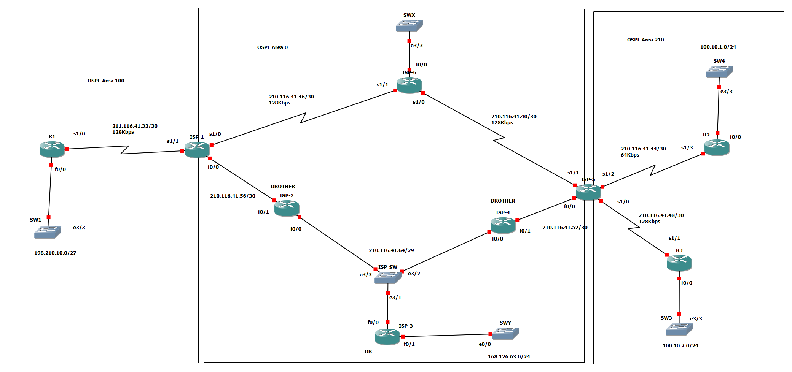

# OSPF Multi-Area & ACL Lab (Cisco IOS / GNS3)


**OSPF Multi-Area, Virtual-Link, DR/BDR, ACL 종합 실습 (Cisco IOS / GNS3)**

---

## 📌 프로젝트 개요

GNS3 / Cisco IOS 환경에서 **6개의 ISP 백본 라우터**와 **3개의 고객사 라우터(R1, R2, R3)**를 OSPF로 구성하고, ISP-1에서 Extended ACL로 트래픽을 제어하는 종합 실습 프로젝트입니다.

| 항목 | 내용 |
| --- | --- |
| 라우팅 프로토콜 | OSPF (Process 100) |
| 라우터 수 | 9대 (ISP 6대 + 고객사 R1/R2/R3) |
| Area 구성 | Area 0 (백본), Area 100, Area 210 |
| 핵심 기술 | Multi-Area OSPF, DR/BDR 선출, Passive Interface, Loopback Point-to-Point, Extended ACL |
| 시뮬레이터 | GNS3 (Cisco IOS c3745) |

---

## 🗺️ 네트워크 토폴로지



### Area 구성

- **OSPF Area 100**: ISP-1 + R1 + 내부 LAN (198.210.10.0/27)
- **OSPF Area 0 (Backbone)**: ISP-1 ~ ISP-6 + SWY LAN (168.126.63.0/24)
- **OSPF Area 210**: ISP-5 + R2 + R3 + 내부 LAN (100.10.1.0/24, 100.10.2.0/24)

### 회선 / 인터페이스 구성

- **WAN 구간 (HDLC)**:
  - `211.116.41.32/30` (R1 ↔ ISP-1) - 128Kbps
  - `210.116.41.40/30` (ISP-6 ↔ ISP-5) - 128Kbps
  - `210.116.41.44/30` (ISP-5 ↔ R2) - **64Kbps**
  - `210.116.41.46/30` (ISP-1 ↔ ISP-6) - 128Kbps
  - `210.116.41.48/30` (ISP-5 ↔ R3) - 128Kbps
  - `210.116.41.52/30` (ISP-4 ↔ ISP-5) - 128Kbps
  - `210.116.41.56/30` (ISP-1 ↔ ISP-2) - 128Kbps
- **Multi-Access 구간 (FastEthernet)**: `210.116.41.64/29`
  - ISP-2 (e3/3), ISP-3 (e3/1), ISP-4 (e3/2)가 **ISP-SW**로 연결
  - → **ISP-3 = DR**, BDR 미선출 (ISP-2/ISP-4 Priority = 0)
- **LAN 구간 (FastEthernet)**:
  - `198.210.10.0/27` (R1 ↔ SW1) - Area 100
  - `100.10.1.0/24` (R2 ↔ SW4) - Area 210
  - `100.10.2.0/24` (R3 ↔ SW3) - Area 210
  - `168.126.63.0/24` (ISP-3 ↔ SWY) - Area 0
  - SWX (ISP-6 e3/3 연결)


### 핵심 포인트

- **R1**의 외부 LAN (198.210.10.0/27)이 ISP-1을 통해 백본으로 진입
- **ISP-1**은 Area 100과 Area 0를 잇는 **ABR**
- **ISP-5**는 Area 0와 Area 210을 잇는 **ABR**
- **ISP-3**은 Multi-Access 구간의 **DR** 역할 (SWY LAN 포함)
- R2 ↔ ISP-5 구간은 **64Kbps**로 가장 저속 → OSPF Cost 영향

---
## 📁 프로젝트 구조

```
OSPF-ACL-Multi-ISP-Network/
├── docs/                              # OSPF / ACL 이론 문서
│   ├── 01-ospf-theory.md
│   ├── 02-ospf-pdu.md
│   ├── 03-ospf-neighbor-state.md
│   ├── 04-dr-bdr.md
│   ├── 05-lsa-type.md
│   ├── 06-virtual-link.md
│   ├── 07-ospf-authentication.md
│   └── 08-acl-theory.md
├── preconfig/                         # 단계별 실습 사전 설정
│   └── 01-ospf-loopback-preconfig.txt
├── verification/                      # 검증 명령어 모음
│   └── verification-commands.md
├── topology/
│   └── OSPF-ACL-Multi-ISP-Network.png
├── LICENSE
└── README.md
```

### 학습 순서

1. 📘 **이론 학습** → [`docs/`](./docs/) 폴더의 문서를 순서대로 읽기
2. 🛠️ **실습 진행** → [`preconfig/`](./preconfig/) 폴더의 설정 파일 따라 입력
3. 🔍 **결과 검증** → [`verification/verification-commands.md`](./verification/verification-commands.md) 명령어로 확인

---
## 📚 OSPF 핵심 이론 요약 (docs/)

자세한 내용은 `docs/` 폴더를 참고하세요.

| 문서 | 내용 |
| --- | --- |
| [01. OSPF 이론](./docs/01-ospf-theory.md) | Link-State 알고리즘, AD=110, Cost 계산법 |
| [02. OSPF 5가지 PDU](./docs/02-ospf-pdu.md) | Hello, DBD, LSR, LSU, LSAck |
| [03. Neighbor State](./docs/03-ospf-neighbor-state.md) | Down→Init→2-Way→ExStart→Exchange→Loading→Full |
| [04. DR/BDR](./docs/04-dr-bdr.md) | Priority 기반 선출, Multi-Access 환경 |
| [05. LSA Type](./docs/05-lsa-type.md) | Type 1~5 (Router/Network/Summary/ASBR-Summary/External) |
| [06. Virtual-Link](./docs/06-virtual-link.md) | Backbone 단절 시 우회 연결 |
| [07. OSPF 인증](./docs/07-ospf-authentication.md) | Plain Text / MD5, Neighbor / Area 인증 |
| [08. ACL 이론](./docs/08-acl-theory.md) | Standard(1 ~ 99) / Extended(100 ~ 199) |

---

## 💡 학습 포인트

- **Multi-Area OSPF**: Area 0(백본)과 비-백본 Area의 ABR 역할 이해
- **DR/BDR 선출 제어**: Priority `0`(선출 제외) / `255`(우선 DR) 활용
- **Passive-interface default**: 보안과 효율을 위한 OSPF 송신 제어
- **Loopback Point-to-Point**: 기본 /32가 아닌 인터페이스 마스크 그대로 광고
- **Extended ACL**: 출발지/목적지 IP + Port + Protocol 조합 필터링
- **OSPF Protocol 89 허용**: ACL 적용 시 OSPF Neighbor가 끊기지 않도록 `permit ospf` 추가

---

## 🎯 실습 목표

| # | 실습 내용 | Preconfig 파일 |
| :---: | --- | --- |
| **EX1** | 라우터 기본 설정 (Loopback / IP / Telnet / Enable 패스워드) | [`01-ospf-loopback-preconfig.txt`](./preconfig/01-ospf-loopback-preconfig.txt) |
| **EX2** | LAN(Ethernet) / WAN(HDLC) IP 할당 및 Next-hop 통신 확인 | *(추가 예정)* |
| **EX3** | OSPF Multi-Area 구성 + ISP-3 DR 선출 + Loopback Area 분리 | *(추가 예정)* |
| **EX4** | ISP-1에서 Extended ACL로 R1 → R2/R3 트래픽 제어 | *(추가 예정)* |
| **EX5** | Routing Table / Database Table / LSA-Type 검증 | [`verification-commands.md`](./verification/verification-commands.md) |

---

## 🛠️ 사용 도구

| 도구 | 용도 |
| --- | --- |
| **GNS3** | 네트워크 시뮬레이션 |
| **Cisco IOS (c3745)** | 라우터 OS |
| **Cisco CLI** | 라우터 명령어 입력 |
| **MobaXterm / PuTTY** | 콘솔 접속 |
| **Git / GitHub** | 형상 관리 |

---

## 📄 License

[MIT License](./LICENSE)
